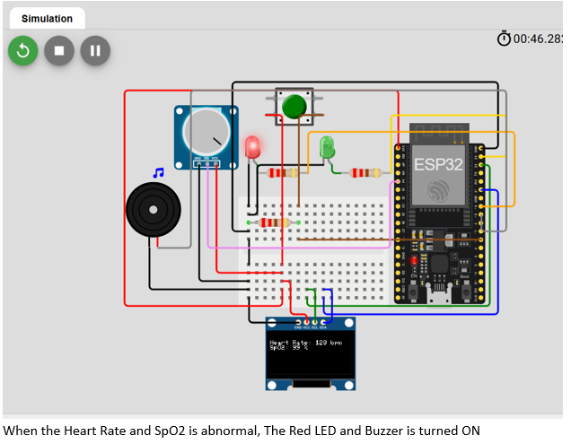
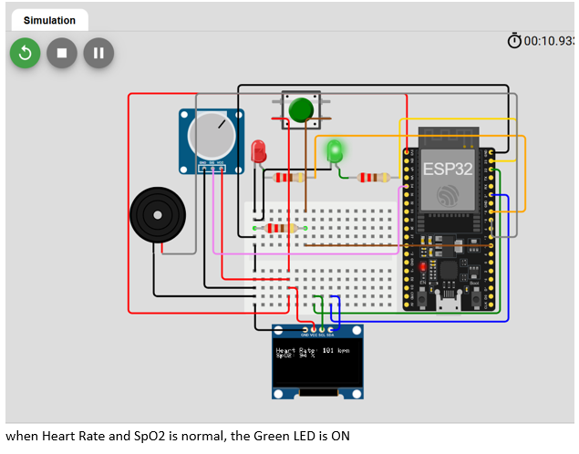
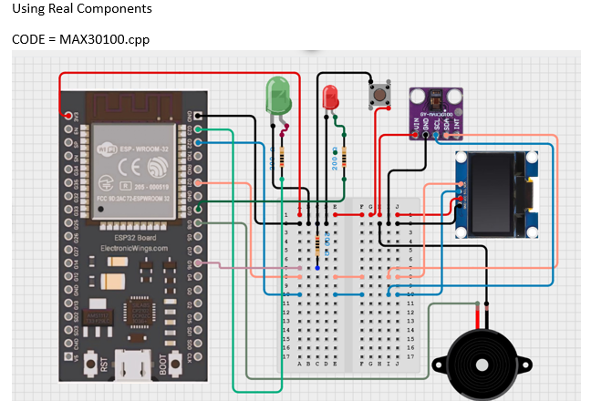

# Heart Rate Monitoring System with ESP32

[](https://opensource.org/licenses/MIT)
[](https://www.arduino.cc/)
[](https://www.espressif.com/en/products/socs/esp32)


# Heart Rate Monitoring System with ESP32

**Project by Master QAT (Qasim Aisha)**  
SSS3 Student | AI & Robotics Enthusiast, ijebu-ode Nigeria

A low-cost wearable prototype for real-time heart rate monitoring. Built to develop **mechatronics** and embedded systems skills for health applications and assistive robotics.

### Features
- Real-time BPM calculation using simulated pulse signal
- OLED display showing live readings
- Visual alerts: Green LED (normal), Red LED (abnormal)
- Buzzer for audio warning
- Adjustable threshold using potentiometer

### Components (Real Hardware)
- ESP32 microcontroller
- MAX30100 Pulse Oximeter sensor (real design)
- OLED Display (SSD1306)
- Red & Green LEDs
- Buzzer
- Potentiometer

**Note**: In the Wokwi simulation, a potentiometer is used to simulate the pulse signal because the MAX30100 sensor component is not available in the free version of Wokwi. The actual hardware version uses the real MAX30100 sensor (see circuit diagram below).

## ⚡ Quick Start (5 minutes)

### Requirements
- ESP32 microcontroller
- MAX30100 sensor
- OLED display (SSD1306)
- Arduino IDE with ESP32 board support

### Setup
1. **Install Libraries** (Tools → Manage Libraries in Arduino IDE):
Adafruit_SSD1306 Adafruit_GFX MAX30100_PulseOximeter

Code

2. **Clone & Open**:
```bash
git clone https://github.com/Master-QAT/Heart-Rate-Monitor.git
Open src/heart-rate-monitor/heart-rate-monitor.ino in Arduino IDE

Upload:

Connect ESP32 via USB
Tools → Board → ESP32 Dev Module
Tools → Port → Select your COM port
Click Upload (Ctrl+U)
Test:

Open Tools → Serial Monitor (115200 baud)
Place finger on MAX30100 sensor
See readings on OLED display
Watch Serial Monitor for debug output
Documentation
Setup Guide - Detailed wiring & troubleshooting
BOM - Complete parts list ($35-55)
Calibration - Sensor accuracy tuning
Safety Info - Medical disclaimer
Live Simulation
Test without hardware: Wokwi Simulation

### Wokwi Simulation (Interactive)
🔗 **Live Simulation**: [https://wokwi.com/projects/460302863710109697](https://wokwi.com/projects/460302863710109697)

### Visuals

  
*Red LED and Buzzer turn ON when reading is abnormal*

  
*Green LED turns ON when reading is normal*

  
*Circuit diagram with actual MAX30100 sensor and components*

### Challenges Faced
- Noisy or unstable readings when simulating pulse signal
- Tuning the threshold to avoid false alerts
- Managing display flicker and timing in the loop
- Difference between simulation (potentiometer) and real MAX30100 sensor behavior

### What I Learned
- How to read analog signals and detect beats on ESP32
- Basic real-time embedded programming and alert systems
- Importance of simulation tools like Wokwi for rapid testing
- The gap between simulated and real hardware (sensor noise, calibration)

### Connection to Physical AI & Future Goals
Inspired by **NVIDIA GTC 2026** and the **Physical AI** wave (GR00T, Isaac Lab, Cosmos), I want to evolve this project into smarter systems.  
Future ideas:
- Use **Isaac Lab** simulation to test wearables on moving bodies
- Generate synthetic data with **Cosmos** to improve accuracy in real conditions
- Combine with Smart Gloves or Muscle EMG projects for intelligent assistive robotics and prosthetics

This project is part of my preparation for **Robotics / Mechatronics** at KAIST.
## 🎓 Why This Project Matters for KAIST

This Heart Rate Monitor demonstrates core competencies required for KAIST's **Robotics & Mechatronics** program:

### **Embedded Systems Mastery**
- Real-time sensor data processing (ESP32, I2C protocol)
- Hardware-software integration (MAX30100 → ESP32 → OLED)
- Low-power design for wearable applications
- Multi-sensor data fusion (future: EMG + gyroscope + accelerometer)

### **Physical AI & Robotics Foundation**
- Wearable health monitoring for assistive robotics
- Foundation for **Isaac Lab** simulation of body-worn sensors
- Path toward intelligent prosthetics & exoskeletons
- Biomedical signal processing skills

### **Professional Engineering Practices**
- Production-quality code with comprehensive documentation
- Safety & ethical considerations documented (medical device disclaimer)
- Open-source contribution standards (MIT license, CONTRIBUTING.md)
- Hardware design & circuit understanding

### **Scalability for Advanced Projects**
This is **Phase 1** of a 3-phase progression:
1. ✅ **Phase 1 (NOW):** Single sensor health monitoring
2. **Phase 2 (Next):** Multi-sensor wearable system (Blood O₂, EMG, Accelerometer)
3. **Phase 3 (Future):** AI-powered assistive robotics using NVIDIA Isaac Lab

---

## 📚 Related Projects in Development
- **Blood Oxygen Monitor** - MAX30100 advanced integration
- **Smart Gloves** - Gesture recognition for sign language
- **Muscle EMG Sensor** - Prosthetic control interface
- **Fall Detection System** - Real-time alert system for elderly care

This represents my foundational work toward KAIST's robotics/mechatronics research.

### Code
Main code: `heart-rate-monitor.ino`  
Real MAX30100 version code is also included in the repository MAX30100.cpp .

### Author
**Master QAT (Qasim Aisha)**  
SSS3 Student preparing for WAEC  
Aspiring KAIST Robotics/Mechatronics Student  
ijebu-ode, Nigeria

**Topics**: esp32, heart-rate-monitor, wearable, mechatronics, physical-ai, student-project
